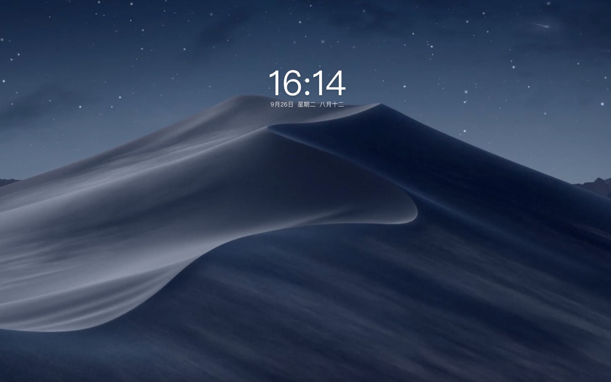

# chrome 自用插件推荐

## 1. [Adblock Plus - 免费的广告拦截器](https://chrome.google.com/webstore/detail/adblock-plus-free-ad-bloc/cfhdojbkjhnklbpkdaibdccddilifddb?utm_source=ext_sidebar&hl=zh-CN)

> Adblock Plus 是世界上最流行的浏览器扩展，世界各地有数百万用户在使用它。这是一个社区驱动的开源项目，有数百名志愿者为 Adblock Plus 的成功作出了贡献，以实现所有烦人的广告被自动阻挡。

## 2. [深色模式 - Сhrome 的深色閱讀器](https://chrome.google.com/webstore/detail/dark-mode-dark-reader-for/pjbgfifennfhnbkhoidkdchbflppjncb?utm_source=ext_sidebar&hl=zh-CN)

> 黑暗主題是每個網站的經典黑暗模式。 深色主題將網站切換為深色閱讀器、夜班模式、夜間和日常瀏覽。 夜班模式
> 黑暗模式 - Chrome 的黑暗閱讀器將在所有網站上放置黑暗主題，適合那些在夜間工作的人和黑暗閱讀器的在線新聞或書籍閱讀。

## 3. [Global Speed: 视频速度控制](https://chrome.google.com/webstore/detail/global-speed/jpbjcnkcffbooppibceonlgknpkniiff?utm_source=ext_sidebar&hl=zh-CN)

> 设置视频和音频的默认速度。

> 速度控制
> • 与几乎所有视频和音频流媒体站点兼容，包括 Youtube，Netflix，哔哩哔哩，腾讯视频，百度网盘， 爱奇艺等。
> • 如果固定，标签可以有自己的播放速率。
> • URL 规则，可根据网站自动设置自定义播放速率。
> • 可选的快捷键来控制速度。

## 4. [iTab 新标签页](https://chrome.google.com/webstore/detail/itab%E6%96%B0%E6%A0%87%E7%AD%BE%E9%A1%B5%E5%85%8D%E8%B4%B9chatgpt/mhloojimgilafopcmlcikiidgbbnelip?utm_source=ext_sidebar&hl=zh-CN)

> iTab 组件式图标自定义您的浏览器的标签页，精美日历、炫酷天气、每日头条、海量壁纸、常用网址随心订制，并有免费 ChatGpt 功能

## 5. [Save All Resources](https://chrome.google.com/webstore/detail/save-all-resources/abpdnfjocnmdomablahdcfnoggeeiedb?utm_source=ext_sidebar&hl=zh-CN)

> 一键下载当前网站所有文件

## 6. [OneTab Plus:标签效率管理扩展](https://chrome.google.com/webstore/detail/onetab-plustab-manage-pro/lepdjbhbkpfenckechpdfohdmkhogojf?utm_source=ext_sidebar&hl=zh-CN)

> 快速管理标签组，减少标签混乱

## 7. [Vimium](https://chrome.google.com/webstore/detail/vimium/dbepggeogbaibhgnhhndojpepiihcmeb?utm_source=ext_sidebar&hl=zh-CN)

> 使用键盘快捷键代替鼠标操作，浏览 web 页面基本告别鼠标
