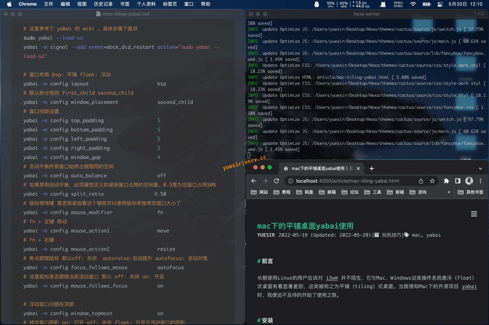
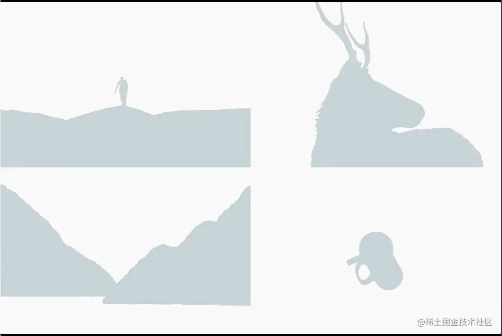

# 解决方案

> 看上去挺优雅的

## 1. [验证码获取](https://juejin.cn/post/7124205596655484965)

> 很 cool

## 2. [ mac 分屏软件 yabai](https://vccv.cc/article/mac-tiling-yabai.html)

> mac 上应该挺好用，配置比较麻烦

长期使用 Linux 的用户应该对 i3wm 并不陌生，它与 Mac、Windows 这类操作系统悬浮（float）式桌面有着显著差别，这类被称之为平铺（tiling）式桌面

## 3. [图片加载](https://juejin.cn/post/7122256732940107813)

> 花哨的图片加载动画,还是很 cool

