# 网站

## 1. [Gitee](https://gitee.com/)

> github 平替，主要为了解决服务器访问 github 自动构建项目时拉取失败

## 2. [Refactoring.Guru](https://refactoringguru.cn/design-patterns)

> 设计模式 mark

## 3. [TypeScript](https://www.typescriptlang.org/)

> typeScript 官网

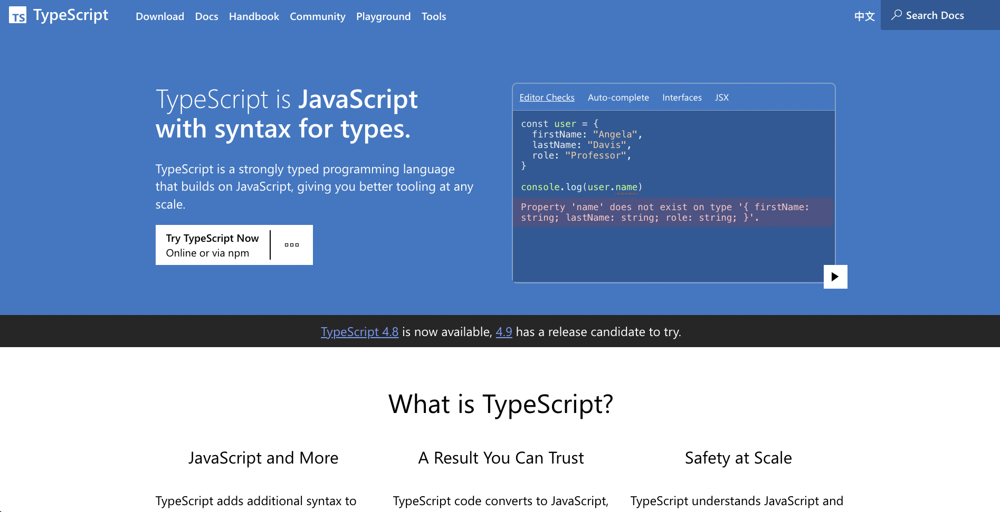

## 4. [MonoCloud](https://mymonocloud.com/)

> 科学上网

## 5. [webp 图片压缩](https://compress-online.com/cn/compress-webp#start)

> webp 格式的图片可以保持惊人的压缩比和分辨率，建议所有图片均采用 webp 格式

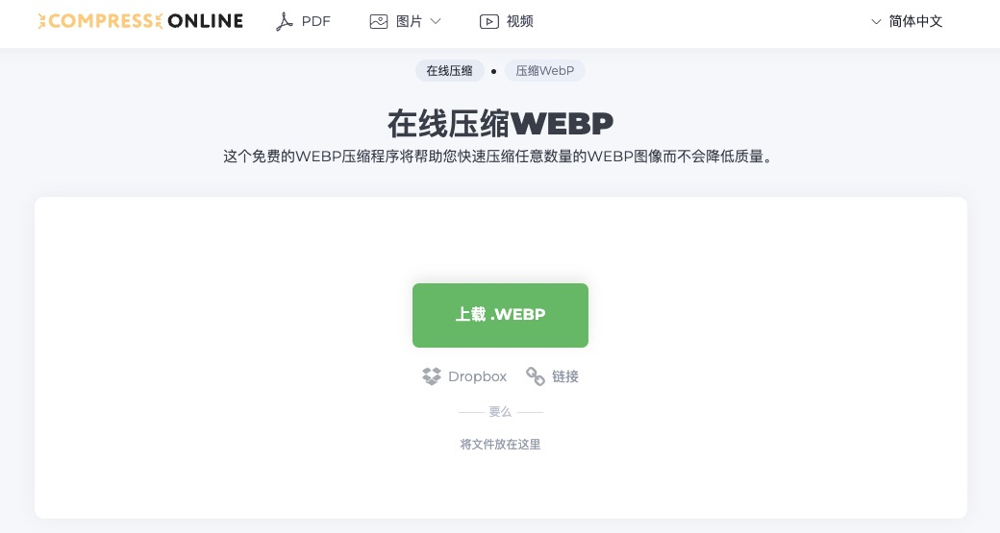

## 6. [Ai 研究所](https://www.aiyjs.com/)

> AI 工具门户网站 工具集合

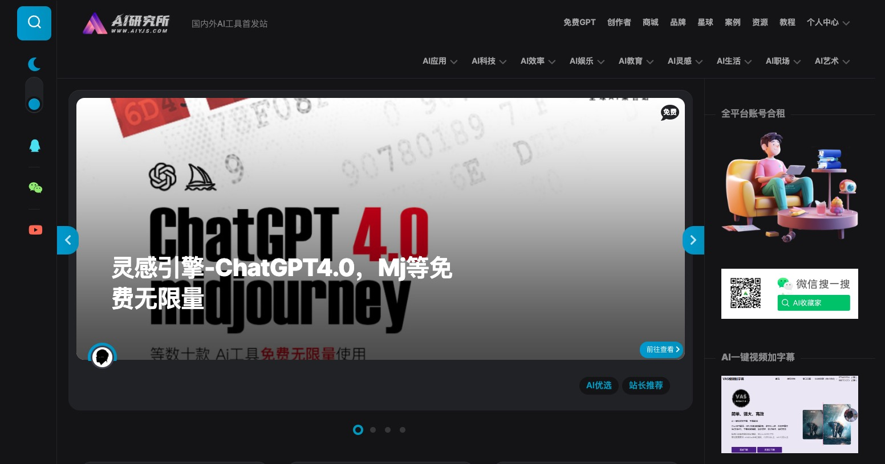

## 7. [阮一峰的网络日志](https://www.ruanyifeng.com/blog/)

> 可能是技术圈传播度最广的博客

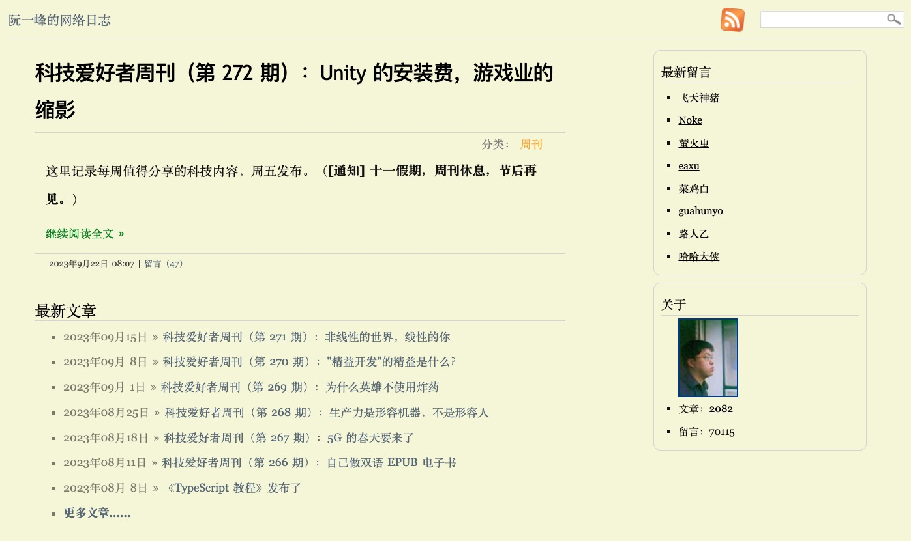

## 8. [snippet](https://snippet-generator.app/)

> 用来在编辑器中生成代码片段

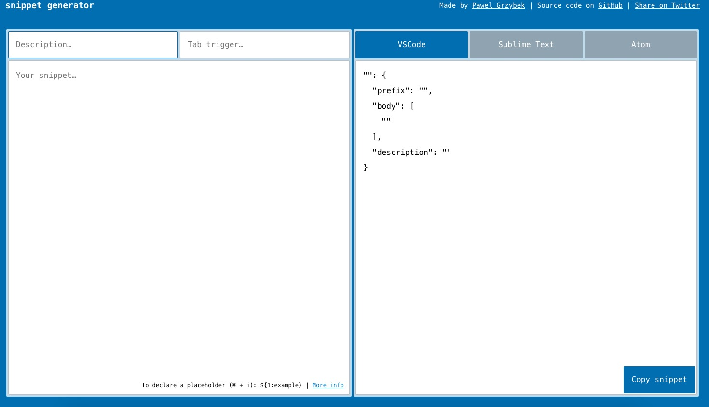

## 9. [iconfont](https://www.iconfont.cn/)

> 自己的项目图标从这里拿

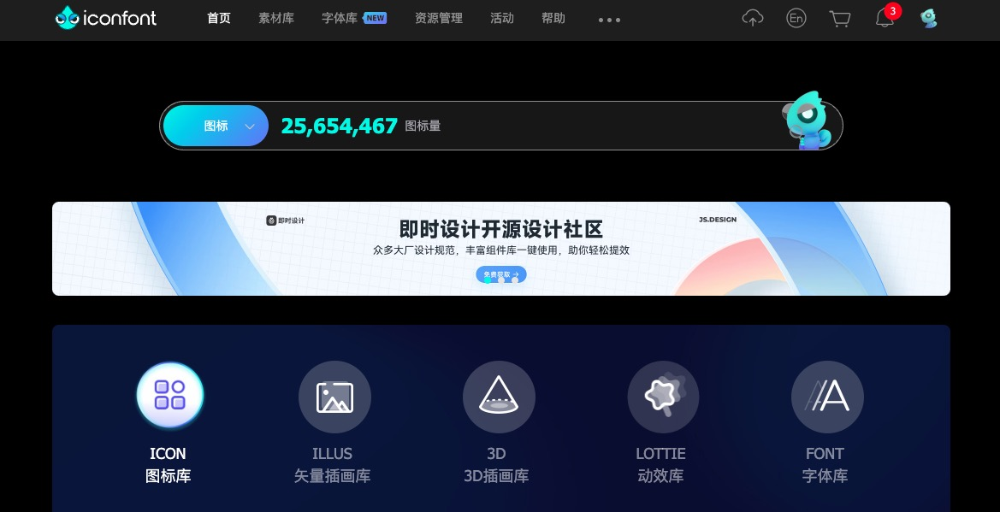

## 10. [websocket 在线测试](http://coolaf.com/tool/chattest)

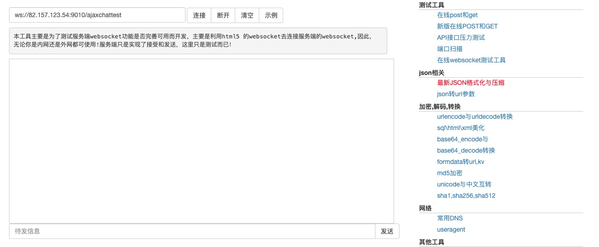

## 11. [中国传统颜色](http://zhongguose.com/)

> 中国色传统颜色取色网站，名词繁多

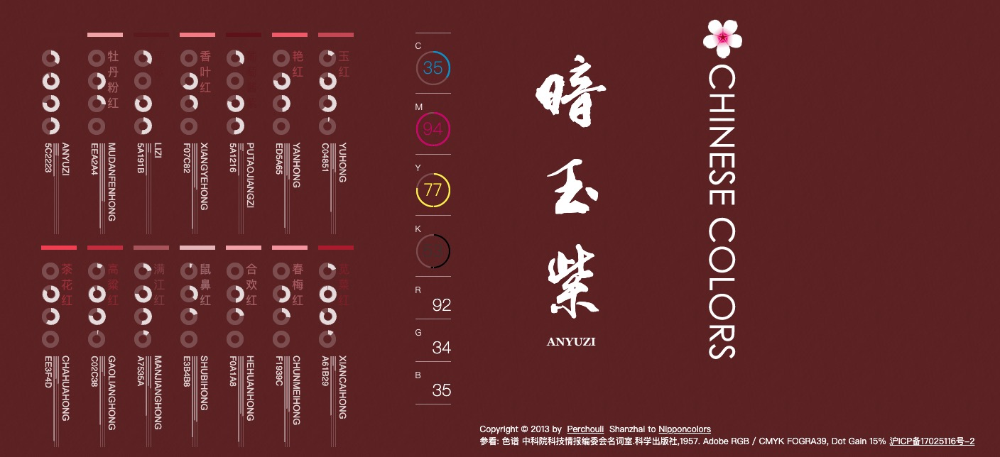

## 12. [shader 中文](https://thebookofshaders.com/?lan=ch)

> shader 入门数据

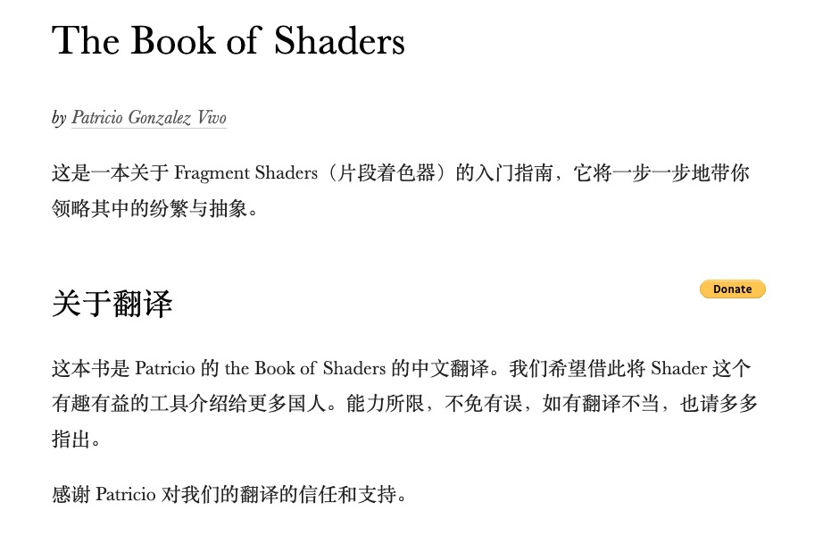

## 13. [webgl 教学博主](https://www.cpengx.cn/)

> 老陈对国内 webgl 教学视频做的比较久了，而且很全就是课程有点贵

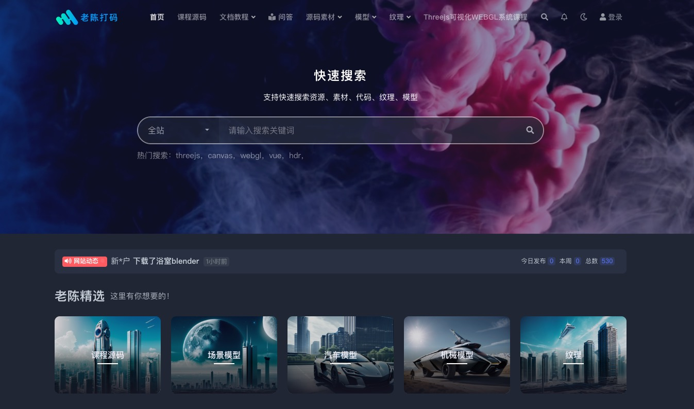

## 14. [glsl 中文手册](https://github.com/wshxbqq/GLSL-Card)

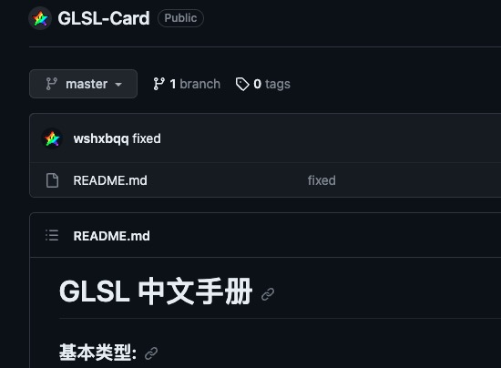

## 15. [shadertoy](https://www.shadertoy.com/)

> glsl 模型

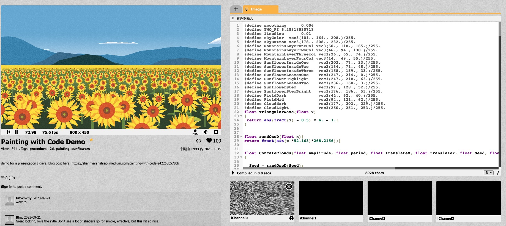
